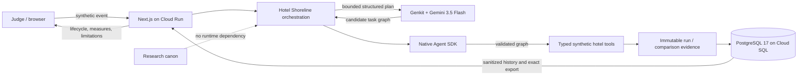

# bgb_labs

`bgb_labs` is a pnpm workspace for Native Agent: a domain-neutral assurance
SDK, the fictional Hotel Shoreline Google hackathon demonstration, and a
separate native-adoption research program.

Hotel Shoreline is built independently for the All Things Agentic Hackathon and
is not affiliated with, endorsed by, or operated by Google. Its hotel data and
results are synthetic and illustrative, not real operations or research findings.

## Judge quick links

- **Live Taskmaster demo:** <https://hotel-shoreline-7larmcl4aa-ew.a.run.app>
- **Public repository:** <https://github.com/marlonthemaker/bgb_labs>
- **Submission package:** [Devpost copy, architecture, claims, disclosures, and
  four-minute storyboard](docs/submission/README.md)
- **Release evidence:** [HSD-008 issue record](issues/HSD-008-submission-release.md)

The shortest tour is: run the fixed request once; inspect the Gemini candidate,
three preserved constraints, lifecycle, nodes, and operations; refresh saved
evidence; reopen a comparison; then download its exact versioned JSON artifact.
Provider failures are retained as typed zero-operation evidence and never
rewritten into a completion claim.

## Workspace map

| Directory | Role | Dependency rule |
| --- | --- | --- |
| [`native_agent_sdk/`](native_agent_sdk/README.md) | Reusable, domain-neutral validated task runtime | Must not import the app, hotel concepts, model providers, or cloud services. |
| [`hotel_shoreline/`](hotel_shoreline/README.md) | Fictional hackathon demonstration | May import the SDK; owns all hotel, UI, fixture, and provider concerns. |
| [`research/`](research/README.md) | Research canon and versioned studies | Never a runtime dependency; public studies require their own access and evidence gates. |
| [`docs/`](docs/README.md) | Cross-project architecture, product, operations, and decisions | Owns shared guidance, not package behavior or mutable issue status. |

## System architecture



The SDK owns domain-neutral contracts, validation, execution, and ordered
evidence. Hotel Shoreline owns its fictional scenario, Gemini/Genkit adapter,
typed hotel tools, evaluation/intervention records, PostgreSQL repository, and
presentation. Planning cannot call a tool directly: every candidate crosses the
same Native Agent contract and allowlist boundary first. The research canon is
deliberately separate from runtime code.

## Current product lifecycle

Native Agent provides the validated, evidence-producing task runtime. Hotel
Shoreline provides the fictional deterministic and Gemini/Genkit demonstration,
including a matched baseline/contract-guided comparison. HSD-007 completed the
portable PostgreSQL evidence ledger: its shared contract, least-privilege Cloud
SQL path, sanitized history API, and merged-main Cloud Run persistence are
locally, CI, and externally verified. The saved-history inspector,
immutable-record retrieval, truthful lifecycle/provenance/measure views, and
deterministic privacy-safe JSON export are also locally, CI, and externally
verified on the merged-main Cloud Run revision. HSD-008 repository, CI, and
deployment gates are complete and the release is in owner review for the public
video, Devpost submission, approved tag, and judging freeze defined by the
[roadmap](ROADMAP.md).

Individual issue metadata owns delivery status; the
[issue index](issues/README.md) is its machine-checked derived view. Completed
acceptance and QA evidence remains in the individual issue records.
The Iberia study is a separate pre-pilot research proposal and does not
authorize public-agent execution.

Read the package roadmaps before changing behavior:

- [Native Agent SDK roadmap](native_agent_sdk/ROADMAP.md)
- [Hotel Shoreline roadmap](hotel_shoreline/ROADMAP.md)
- [HSD product roadmap](ROADMAP.md)
- [Architecture boundaries](docs/architecture/BOUNDARIES.md)
- [Product, research, and demonstration surfaces](docs/product/SURFACES.md)
- [Native-adoption research canon](research/canon/README.md)
- [Iberia field-study proposal](research/ailitw/studies/iberia-2026/README.md)
- [Hotel Shoreline controlled comparison protocol](hotel_shoreline/EVALUATION_PROTOCOL.md)
- [Hotel Shoreline native-language review guide](hotel_shoreline/NATIVE_REVIEW_GUIDE.md)
- [Hotel Shoreline PostgreSQL evidence-ledger architecture](hotel_shoreline/DATA_ARCHITECTURE.md)
- [Testing convention](TESTING.md)
- [Contributor guide](CONTRIBUTING.md)
- [Issue index](issues/README.md)
- [Google Cloud setup and deployment guide](docs/operations/GOOGLE_CLOUD_SETUP.md)
- [Security policy](SECURITY.md)
- [Production dependency risk](docs/operations/DEPENDENCY_RISK.md)
- [Repository security controls](docs/operations/REPOSITORY_SECURITY.md)
- [Submission package](docs/submission/README.md)

## Local setup

Requires Node `22.17.0` and pnpm `10.13.1`.

```sh
corepack enable
pnpm install --frozen-lockfile
pnpm verify:release
pnpm check
pnpm audit:prod
pnpm typecheck
pnpm test:all
pnpm build
```

The browser test requires Playwright Chromium once per environment:

```sh
pnpm exec playwright install chromium
```

Start the credential-free deterministic experience:

```sh
pnpm meow
```

Open <http://localhost:3000>. `pnpm test:all` starts its own isolated server and
does not reuse this process.

`pnpm meow` always starts the reliable deterministic planner, even when
`.env.local` contains a Gemini setting. Use the explicitly quota-bearing
`pnpm meow:gemini` command only when manually testing the provider path.

Local Gemini mode reads server-only values from
`hotel_shoreline/.env.local`; start from
[`hotel_shoreline/.env.example`](hotel_shoreline/.env.example). The committed
default CI/full-gate path remains deterministic and credential-free. The
separate real-Gemini browser checks are opt-in and skipped unless explicitly
enabled with approved credentials. Store local credentials only in the ignored
`hotel_shoreline/.env.local`, then run `pnpm test:e2e:gemini` for HSD-004,
`pnpm test:e2e:gemini:comparison` for one HSD-005 pair, or the deliberately
paced `pnpm test:e2e:gemini:matrix` for all nine blocks. The scripts expose only
the non-secret opt-in flag to Playwright and explicitly select Gemini. The
ordinary browser suite explicitly selects deterministic mode, regardless of
the local file.

The current Cloud Run/Cloud SQL deployment is intentionally public because the
data and tools are synthetic and judges need access. New cloud environments
follow the [Google Cloud bootstrap](docs/operations/GOOGLE_CLOUD_SETUP.md),
[Cloud SQL runbook](hotel_shoreline/CLOUD_SQL.md), and candidate-first
[Cloud Run release runbook](hotel_shoreline/CLOUD_RUN.md). Do not place a key in
Git or use a `NEXT_PUBLIC_` secret.

## Release and disclosure

Repository code is MIT licensed; third-party packages retain their own
licences. The submitted application was built during the hackathon period using
standard open-source dependencies and AI coding assistance. Pre-existing
native-adoption research framing is disclosed under `research/`, is never a
runtime dependency, and is not presented as a result produced by Hotel
Shoreline. Direct dependency inventory, accepted advisory risk, claims, and
owner-only video/Devpost steps are recorded in the
[submission package](docs/submission/README.md).

## Quality standard

Biome is the single formatter and linter. TypeScript is strict. Every
behavior-changing acceptance criterion has a traceable test, and the full gate
includes unit, integration, browser E2E, coverage, and production build checks.
