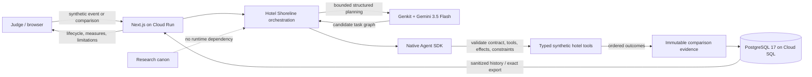

# Hotel Shoreline Submission Package

This is the canonical copy/recording/release package for the All Things Agentic
Hackathon Taskmaster submission. The official [rules](https://allthingsagentichackathon.devpost.com/rules)
and [FAQ](https://allthingsagentichackathon.devpost.com/details/faqs) remain
authoritative. They were last checked on 2026-08-27; submission closes August
31, 2026 at 5:00 PM PT.

## Submission coordinates

| Field | Value |
| --- | --- |
| Project | Hotel Shoreline |
| Category | Taskmaster |
| Tagline | Turn a messy guest request into constrained, validated action—and evidence you can inspect. |
| Live project | <https://hotel-shoreline-7larmcl4aa-ew.a.run.app> |
| Repository | <https://github.com/marlonthemaker/bgb_labs> |
| Licence | MIT for repository code; dependencies retain their own licences. |
| Owner action — public video URL | Supply the final public YouTube or Vimeo URL before Devpost submission. |

## Copy-ready Devpost description

### Inspiration and friction

A hotel guest can ask for several things in one sentence: fix the hot water,
send exactly two towels, use the correct room, and do not add a charge. A
chatbot can write a reassuring answer while dropping a constraint or never
taking action. Hotel Shoreline asks a harder question: can an agent turn one
messy service event into a bounded workflow, prove what it attempted, and fail
safely when the plan or provider is wrong?

### What it does

Hotel Shoreline is a fictional, synthetic Taskmaster demonstration. One guest
event invokes a server-side Gemini 3.5 Flash planner through Genkit. The planner
proposes a structured task graph; the domain-neutral Native Agent SDK validates
dependencies, allowlisted tools, prohibited effects, and required constraints
before any tool can run. Typed synthetic maintenance and housekeeping adapters
then execute the accepted graph and emit ordered lifecycle and operation
evidence.

The demo also runs a matched baseline/contract-guided comparison across three
case families and authored `en`, `es-ES`, and `pt-PT` variants. Both arms retain
the same validation and tool safety boundary; only the declared planning
guidance changes. Every attempt—including rejection, timeout, quota failure,
and zero-operation outcomes—is eligible for retention. A least-privilege
PostgreSQL ledger stores immutable synthetic comparison records. The UI can
reopen an exact record, show source/configuration/version hashes, lifecycle,
earliest loss, deterministic measure definitions and denominators, and download
a versioned privacy-safe JSON artifact.

### How we built it

- Gemini 3.5 Flash and `genkit`/`@genkit-ai/google-genai` provide the bounded
  server-side planning boundary.
- `@bomgoodbueno/native-agent-sdk` provides model-neutral semantic contracts,
  task-graph validation, deterministic execution, typed errors, and ordered
  evidence.
- `next`, `react`, and `react-dom` provide the accessible web and Route Handler
  surfaces on Cloud Run.
- `pg` provides a portable application-owned repository adapter to PostgreSQL
  17 on Cloud SQL.
- Secret Manager, separate build/runtime identities, pinned numeric secret
  versions, an append-only database role, scale-to-zero, and bounded concurrency
  constrain the public hackathon deployment.
- Vitest, Playwright, strict TypeScript, Biome, a real PostgreSQL contract in CI,
  deterministic coverage gates, and candidate-before-traffic deployment provide
  the release evidence.

### Data sources

All hotel, stay, room, policy, request, tool, and outcome data is invented for
this demonstration. There is no real hotel integration, guest record, personal
data, runtime translation, or external research dataset. Authored locale
variants are versioned project drafts with `pending_review` status; they remain
excluded from reviewer-qualified language claims.

### Findings and learnings

The engineering evidence shows that explicit semantic contracts make missing
tasks and constraints observable, invalid graphs can be rejected before tool
execution, provider failures can terminate with zero operations and no false
completion claim, and immutable evidence can survive a Cloud Run revision
change through a portable PostgreSQL boundary. The matched examples are
illustrative observations under frozen fictional conditions, not a research
finding, causal estimate, native-language score, or general model benchmark.

### Value and public contribution

The immediate value is operational legibility: developers and reviewers can see
where an agent lost information—input, understanding, decomposition,
reason/retrieval, action, or response—rather than accepting a fluent answer as
proof. The reusable contribution is a small public reference for semantic
contracts, fail-closed task graphs, typed tools, lifecycle evidence, matched
intervention conditions, append-only provenance, and honest claim boundaries.

## Architecture



Boundary summary:

- Native Agent SDK is domain-, model-, framework-, cloud-, and hotel-neutral.
- Hotel Shoreline owns synthetic scenarios, Genkit/Gemini orchestration, typed
  hotel adapters, evaluation/intervention records, persistence, and UI.
- Both comparison arms pass through the same Native Agent validation and tool
  boundary; “baseline” never means unsafe execution.
- Cloud SQL is reached only by the server runtime through a bounded pool and an
  append-only `SELECT`/`INSERT` login. Browser responses are sanitized DTOs.
- The research canon can inspire hypotheses but is never imported by runtime
  code and is not evidence that the demonstration produced research findings.

## Claims and limitations

Safe claims:

- The deployed demo uses Gemini 3.5 Flash, Genkit, Cloud Run, Cloud SQL, and
  Secret Manager.
- After one event/button action, the Taskmaster flow plans, validates, and
  executes its multi-step synthetic workflow without per-step user direction.
- Invalid or unavailable planning cannot bypass validation or silently claim
  tool completion.
- Saved synthetic evidence can be reopened and exported with explicit
  provenance and limitations.

Do not claim:

- affiliation with, endorsement by, or operation by Google;
- real hotel readiness, real guest service, production SLA, HA, backup/PITR,
  authentication, multi-tenancy, or a hard cloud-spend cap;
- background queue/worker execution, unrestricted autonomous authority, or
  hidden model reasoning/chain-of-thought;
- a statistically significant intervention effect, language parity, native
  language quality, cultural validity, or general model superiority; or
- that a provider timeout/quota/availability failure is an application success.

Hotel Shoreline is built independently and is not affiliated with, endorsed by,
or operated by Google. Its synthetic results are illustrative and are not
research findings.

## Pre-existing work disclosure

Hotel Shoreline and its submitted runtime implementation were created during
the hackathon submission period. The project incorporates standard open-source
frameworks/libraries and used AI coding assistance for scaffolding, debugging,
testing, and documentation. Native-adoption research framing and conceptual
canon include pre-existing work. That canon is disclosed in `research/`, is not
a runtime dependency, and is not presented as empirical evidence produced by
this demonstration.

## Third-party inventory

Direct production dependencies are the versioned sources of truth in
`hotel_shoreline/package.json` and `pnpm-lock.yaml`:

| Dependency | Purpose |
| --- | --- |
| `@genkit-ai/google-genai` | Gemini provider adapter for Genkit. |
| `genkit` | Google agent framework and structured generation boundary. |
| `next` | Server-rendered application and HTTP Route Handlers. |
| `pg` | Standard PostgreSQL client for the evidence-ledger adapter. |
| `react`, `react-dom` | Accessible browser presentation. |

The workspace also uses Node.js, pnpm, TypeScript, Biome, Vitest, Playwright,
and type-definition packages for build and QA. These tools and all transitive
packages retain their own licences. `pnpm-lock.yaml` is the complete resolved
inventory; the time-bounded security disposition is
[`docs/operations/DEPENDENCY_RISK.md`](../operations/DEPENDENCY_RISK.md).

## Four-minute video storyboard

Target runtime: **3:55**. Use English narration or accurate English subtitles.
Keep the live address bar visible during the proof segment. Rehearse once with a
stopwatch; do not speed up footage or hide a failed call with a cut.

| Time | Picture | Narration / proof |
| --- | --- | --- |
| 0:00–0:20 | Title, one-sentence guest request, visible fictional disclosure. | “A fluent reply is not proof that an agent retained every task and constraint. Hotel Shoreline turns one messy guest event into constrained action and evidence.” |
| 0:20–0:45 | Architecture diagram. | Name Gemini 3.5 Flash, Genkit, Native Agent validation, typed tools, Cloud Run, and PostgreSQL on Cloud SQL. Emphasize separation of planning, assurance, action, and evidence. |
| 0:45–1:50 | **Unedited live proof-of-action:** `.run.app` URL visible; click “Run fixed request” once; wait; inspect candidate, three constraints, lifecycle, two nodes, and two operations. | Explain that no per-step guidance occurs after the event. If the provider returns a typed failure, state it truthfully and record a new take later—never splice it into a false success. |
| 1:50–2:45 | Refresh saved evidence and reopen a known comparison. Show baseline vs contract-guided configuration, rejection/failure/success states, first loss, operations, measures, and `pending_review` exclusion. | “Both arms keep the same validation and tool authority. The intervention changes only declared planning guidance. These are illustrative engineering observations, not native-language or causal findings.” |
| 2:45–3:15 | Download JSON evidence; briefly show schema, comparison ID, source hash, claim boundary. | Explain immutable exact export, typed 400/404 boundaries, append-only provenance, and no secrets/raw exceptions/hidden prompts. |
| 3:15–3:35 | Cloud Run console or service details plus `.run.app`; Cloud SQL instance/revision name without environment values. | Show strict Google Cloud proof, merged revision, 100% traffic, bounded resources, and durable retrieval across revisions. Do not open secret values, environment dumps, IAM tokens, or database URLs. |
| 3:35–3:55 | Return to UI disclosure and repository architecture/QA summary. | “This is a synthetic reference, not a hotel product or research result. Its contribution is a reusable way to make agent decomposition, validation, action, and limitations inspectable.” |

### Recording safety

- Close `.env.local`, terminals with exported values, Secret Manager payloads,
  database URLs, access tokens, personal email/account menus, billing details,
  and unrelated browser tabs before recording.
- Use synthetic comparison IDs and allowlisted Cloud Run metadata only. Do not
  show provider request/response payloads or raw database rows.
- Record a genuine provider call once per take. A typed provider failure is a
  valid safety demonstration but does not satisfy the desired live success
  shot; wait for a deliberate later take rather than rapid retries.
- Keep the disclaimer visible at the opening and end. Say “structured planning
  evidence,” not “chain-of-thought” or “reasoning trace.”
- Confirm final duration is at most 4:00 and the upload is publicly visible on
  YouTube or Vimeo.

## Screenshot checklist

1. Desktop landing page with `.run.app`, disclosure, and fixed request.
2. Successful candidate/lifecycle/two-operation Taskmaster evidence.
3. Saved baseline/contract-guided comparison with review exclusion and first loss.
4. Exact JSON evidence header/schema/claim boundary with no sensitive content.
5. Cloud Run revision/traffic and Cloud SQL instance identity with no secret or
   personal account value.
6. Approximately 390 px mobile evidence/disclosure view with no horizontal overflow.

## Judge reproduction

From a clean clone with Node `22.17.0` and corepack:

```sh
corepack enable
pnpm install --frozen-lockfile
pnpm verify:release
pnpm check
pnpm audit:prod
pnpm typecheck
pnpm test:all
pnpm build
pnpm meow
```

Open <http://localhost:3000>. The ordinary app/test path is deterministic and
requires no credential. Optional Gemini mode uses only ignored
`hotel_shoreline/.env.local` values as documented in the root README. Cloud
bootstrap and candidate-first deployment are documented in
[`docs/operations/GOOGLE_CLOUD_SETUP.md`](../operations/GOOGLE_CLOUD_SETUP.md)
and [`hotel_shoreline/CLOUD_RUN.md`](../../hotel_shoreline/CLOUD_RUN.md).

## Final operator checklist

Repository-complete gates:

- [ ] HSD-008 release verifier, clean clone, full deterministic gate, build,
  PR CI, public repository, live service, API, browser, cloud config, and logs pass.
- [ ] Official rules/FAQ are re-read on the submission date.
- [ ] Root README, this package, deployed revision, screenshots, video narration,
  and Devpost text describe the same behavior and limitations.
- [ ] Dependency/security disposition is current and no credential/generated
  artifact is tracked.

Owner actions:

- [ ] Record/rehearse the ≤4:00 video and verify the unedited live segment.
- [ ] Upload it publicly to YouTube or Vimeo and replace the owner-action field
  above with the final URL in an approved release commit.
- [ ] Create/complete the Devpost entry, choose Taskmaster, add every team member,
  paste the description, live URL, repository, architecture, video, and testing
  instructions, and disclose pre-existing research framing.
- [ ] Submit before August 31, 2026 at 5:00 PM PT and capture the confirmation.
- [ ] Approve an annotated release tag pointing to the exact submitted commit.
- [ ] Freeze the submitted repository/video/live surface through judging and
  winner announcement; continue later work only on a separate post-release line.

Optional bonus actions, only after the core submission is safe:

- publish a public build article or video that explicitly says it was created
  for the All Things Agentic Hackathon; and/or
- publish an eligible social post using the exact hashtag required by the
  current official rules.
